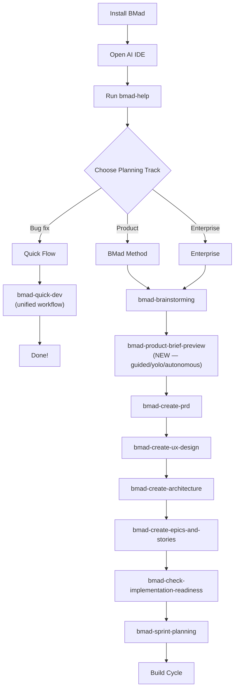

# BMad Method — Playbook v6.2.0

> Comprehensive operational guide for BMad Method — installation, Day 1 workflow, cheat sheet, troubleshooting, best practices.

---

## Installation & Setup

### Prerequisites

| Requirement | Version | Notes |
|---|---|---|
| **Node.js** | ≥ 20.0.0 | Required |
| **Git** | Latest | Recommended |
| **AI IDE** | Latest | Claude Code, Cursor, Gemini CLI, Codex CLI, +16 other platforms |
| **npm** | Bundled with Node.js | Needed for `npx` |

### Installation — Interactive Mode

```bash
# Install BMad Method (interactive — stable version)
npx bmad-method install

# Get the latest from tip of main (prerelease)
npx bmad-method@next install

# Specify exact version if stuck on stale cache
npx bmad-method@6.2.0 install
```

**Steps the installer will ask:**

1. **Select modules** — Choose modules to install (BMM, BMB, TEA, GDS, CIS, WDS)
2. **Select IDE** — Choose your AI IDE (20+ platforms: Claude Code, Cursor, Gemini CLI...)
3. **Configure paths** — Output artifacts path
4. **Project name** — Project name
5. **Skill level** — beginner / intermediate / expert
6. **Confirm** — Review and confirm

### Installation — Non-Interactive Mode (CI/CD)

```bash
# Basic installation
npx bmad-method install --directory /path/to/project --modules bmm --tools claude-code --yes

# Install multiple modules
npx bmad-method install --directory ./my-project --modules bmm,tea,bmb --tools cursor --yes

# With custom content
npx bmad-method install --directory ./my-project --modules bmm --tools claude-code --custom-content ./custom --yes
```

| Flag | Description |
|---|---|
| `--directory <path>` | Project path |
| `--modules <list>` | Modules to install (comma-separated: `bmm`, `bmb`, `tea`, `gds`, `cis`, `wds`) |
| `--tools <ide>` | IDE target: `claude-code`, `cursor`, `gemini`, `codex`, `windsurf`, `opencode`, +14 others |
| `--yes` | Skip confirmation |
| `--custom-content <path>` | Custom content directory |

### Post-Installation Result

```
your-project/
├── _bmad/                         # BMad configuration
│   ├── bmm/                       # BMM module
│   │   ├── config.yaml            # Resolved settings
│   │   ├── agents/                # Agent persona skill dirs
│   │   ├── skills/                # Workflow skill dirs
│   │   └── data/                  # Reference data
│   └── core/                      # Core skills
├── _bmad-output/
│   ├── planning-artifacts/        # PRD, Architecture, Epics
│   ├── implementation-artifacts/  # Sprint status, Stories
│   └── project-context.md         # (optional) Implementation rules
├── .claude/skills/                # Installed skills (depends on IDE)
│   ├── bmad-help/SKILL.md
│   ├── bmad-create-prd/SKILL.md
│   └── ...                        # 44 SKILL.md files total
└── docs/                          # Project knowledge
```

### Uninstall

```bash
# Interactive uninstall
npx bmad-method uninstall

# Or remove manually
rm -rf _bmad/ _bmad-output/ .claude/skills/bmad-*
```

### Upgrade from 6.0.x → 6.2

```bash
# 1. Backup current artifacts
cp -r _bmad-output/ _bmad-output-backup/

# 2. Re-run installer
npx bmad-method@6.2.0 install

# 3. Verify skills have regenerated
ls .claude/skills/
```

> ⚠️ **Breaking changes V6.1:** The entire system has migrated to **skills-based architecture**. Legacy YAML/XML workflow engine has been completely removed. Path variables changed from `@` prefix to `{project-root}` syntax. Terminology: "commands" → "skills".

---

## Day 1 Workflow

### Greenfield Project (New Project)



### Brownfield Project (Existing Project)

1. **Install BMad** — `npx bmad-method install` in the existing project folder
2. **Run `/bmad-help`** — BMad-Help will detect project state
3. **Create Project Context** — `/bmad-generate-project-context` to document technical preferences
4. **Choose track** — Quick Flow for small changes, BMad Method for major features
5. **Start from the appropriate phase** — Can skip Phase 1 if direction is already clear

### Build Cycle (Repeat for each story)

| Step | Agent | Skill | Command | Description |
|---|---|---|---|---|
| 1 | Scrum Master | `bmad-create-story` | `/bmad-create-story` | Create story file from epic |
| 2 | Developer | `bmad-dev-story` | `/bmad-dev-story` | Implement story (new chat!) |
| 3 | Developer | `bmad-code-review` | `/bmad-code-review` | Review code (sharded: 4-step parallel review) |
| 4 | Scrum Master | `bmad-retrospective` | `/bmad-retrospective` | After completing an epic |

> ⚡ **IMPORTANT:** Always use a **fresh chat** for each workflow!

---

## Daily Operations

### Daily Operations Checklist

```markdown
## Every day when starting work:
1. Open AI IDE in project folder
2. Run `/bmad-help` → view project state and next steps
3. Run `/bmad-create-story` for the next story (new chat)
4. Run `/bmad-dev-story` to implement (new chat)
5. Run `/bmad-code-review` when finished (new chat)
6. Commit code frequently

## When an epic is completed:
1. Run `/bmad-retrospective` (new chat)
2. Review sprint-status.yaml
3. Continue to the next epic

## When scope changes:
1. Run `/bmad-correct-course` with SM agent (new chat)
2. Update PRD if needed
3. Re-plan epics
```

### Creating Project Context (Recommended)

Project Context helps AI agents understand your technical preferences:

```bash
# Method 1: Auto-generate after having architecture
/bmad-generate-project-context

# Method 2: Create manually
# Create file _bmad-output/project-context.md with content:
```

```markdown
# Project Context

## Technology Stack
- Frontend: React 18 + TypeScript
- Backend: Node.js + Express
- Database: PostgreSQL
- ORM: Prisma

## Implementation Rules
- Use TypeScript strict mode
- All API responses must follow REST conventions
- Error handling with custom error classes
- Unit test coverage minimum 80%
```

---

## Strategic Configuration

### Presets by Project Type

| Project Type | Modules | Skill Level | Track |
|---|---|---|---|
| **Side project / MVP** | `bmm` | intermediate | Quick Flow |
| **Startup product** | `bmm` + `cis` | intermediate | BMad Method |
| **Enterprise app** | `bmm` + `tea` | expert | Enterprise |
| **Game** | `bmm` + `gds` | intermediate | BMad Method |
| **Custom agents** | `bmm` + `bmb` | expert | BMad Method |
| **Design-heavy** | `bmm` + `wds` | intermediate | BMad Method |
| **Full suite** | `bmm` + `bmb` + `tea` + `cis` | expert | Enterprise |

### When to Use Each Agent?

| Situation | Agent | Skill |
|---|---|---|
| Have a new idea to explore | Analyst (Mary) | `/bmad-brainstorming` |
| Need market research | Analyst (Mary) | `/bmad-market-research` |
| Need domain research | Analyst (Mary) | `/bmad-domain-research` |
| Need technical research | Analyst (Mary) | `/bmad-technical-research` |
| Create product brief (new) | Analyst (Mary) | `/bmad-product-brief-preview` |
| Write requirements | PM (John) | `/bmad-create-prd` |
| Validate PRD | PM (John) | `/bmad-validate-prd` |
| Design UI/UX | UX Designer (Sally) | `/bmad-create-ux-design` |
| Design architecture | Architect (Winston) | `/bmad-create-architecture` |
| Sprint planning | Scrum Master (Bob) | `/bmad-sprint-planning` |
| View sprint status | Scrum Master (Bob) | `/bmad-sprint-status` |
| Implement code | Developer (Amelia) | `/bmad-dev-story` |
| Review code | Developer (Amelia) | `/bmad-code-review` |
| E2E tests | QA (Quinn) | `/bmad-qa-generate-e2e-tests` |
| Bug fix / small change | Quick Flow (Barry) | `/bmad-quick-dev` |
| Group discussion | Party Mode | `/bmad-party-mode` |
| Don't know what to do next | BMad-Help | `/bmad-help` |

---

## Cheat Sheet

### Core Skills (available in all modules)

| Skill | Phase | Description |
|---|---|---|
| `/bmad-help` | Any | 🌟 Intelligent guide — ask anything |
| `/bmad-brainstorming` | Any | Guided ideation session |
| `/bmad-party-mode` | Any | Multi-agent collaboration |
| `/bmad-review-adversarial-general` | Any | Adversarial content review |
| `/bmad-review-edge-case-hunter` | Any | Edge case analysis for code |
| `/bmad-distillator` | Any | Lossless LLM-optimized document compression |
| `/bmad-editorial-review-prose` | Any | Review prose quality |
| `/bmad-editorial-review-structure` | Any | Review document structure |
| `/bmad-advanced-elicitation` | Any | Advanced questioning techniques |
| `/bmad-index-docs` | Any | Create doc index for LLM scanning |
| `/bmad-shard-doc` | Any | Split large markdown file |

### BMM Phase 1: Analysis Skills

| Skill | Agent | Description |
|---|---|---|
| `/bmad-product-brief-preview` | Analyst | 🆕 Guided/Yolo/Autonomous product brief creation |
| `/bmad-create-product-brief` | Analyst | Foundation document |
| `/bmad-market-research` | Analyst | Market analysis, competitive landscape |
| `/bmad-domain-research` | Analyst | Industry domain deep dive |
| `/bmad-technical-research` | Analyst | Technical feasibility analysis |
| `/bmad-document-project` | Analyst | Analyze existing project for docs |

### BMM Phase 2: Planning Skills

| Skill | Agent | Description |
|---|---|---|
| `/bmad-create-prd` | PM | Product Requirements Document |
| `/bmad-validate-prd` | PM | Validate PRD completeness |
| `/bmad-edit-prd` | PM | Improve existing PRD |
| `/bmad-create-ux-design` | UX | UX Design document |

### BMM Phase 3: Solutioning Skills

| Skill | Agent | Description |
|---|---|---|
| `/bmad-create-architecture` | Architect | Architecture document |
| `/bmad-create-epics-and-stories` | PM | Break PRD → epics |
| `/bmad-check-implementation-readiness` | Architect | Validate planning cohesion |
| `/bmad-generate-project-context` | Analyst | Generate project context from codebase |

### BMM Phase 4: Implementation Skills

| Skill | Agent | Description |
|---|---|---|
| `/bmad-sprint-planning` | SM | Initialize sprint tracking |
| `/bmad-sprint-status` | SM | 🆕 Summarize sprint status |
| `/bmad-create-story` | SM | Create story file |
| `/bmad-dev-story` | Developer | Implement story |
| `/bmad-quick-dev` | Barry | 🆕 Unified quick flow (clarify → plan → implement → review → present) |
| `/bmad-code-review` | Developer | 🆕 Sharded parallel code review (4 steps) |
| `/bmad-qa-generate-e2e-tests` | QA | Generate E2E tests |
| `/bmad-correct-course` | SM | Handle scope changes |
| `/bmad-retrospective` | SM | Epic retrospective |

### Agent Skills (Load persona)

| Skill | Agent Persona |
|---|---|
| `/bmad-agent-analyst` | Mary — Analyst |
| `/bmad-agent-pm` | John — Product Manager |
| `/bmad-agent-architect` | Winston — Architect |
| `/bmad-agent-sm` | Bob — Scrum Master |
| `/bmad-agent-dev` | Amelia — Developer |
| `/bmad-agent-qa` | Quinn — QA Engineer |
| `/bmad-agent-quick-flow-solo-dev` | Barry — Quick Flow Solo Dev |
| `/bmad-agent-ux-designer` | Sally — UX Designer |
| `/bmad-agent-tech-writer` | Paige — Technical Writer |

### CLI Commands

| Command | Description |
|---|---|
| `npx bmad-method install` | Interactive install |
| `npx bmad-method@next install` | Install latest prerelease |
| `npx bmad-method install --directory <path> --modules <m> --tools <ide> --yes` | Non-interactive |
| `npx bmad-method uninstall` | Remove components |
| `npx bmad-method@<version> install` | Install specific version |

---

## Troubleshooting

| Error | Cause | Fix |
|---|---|---|
| **Skills not showing in IDE** | IDE hasn't enabled skills or needs restart | Check IDE settings → enable skills → restart/reload |
| **`npx bmad-method` gives old version** | npm cache is stale | `npx bmad-method@6.2.0 install` or `@next` |
| **Old module skills still present** | Installer doesn't auto-delete | Remove manually: `rm -rf .claude/skills/bmad-*` → re-install |
| **Nested install rejected** | Ancestor directory already has BMAD | Install at project root, no nesting |
| **Workflow context errors** | Running multiple workflows in same chat | **Always use fresh chat** for each workflow |
| **Brainstorming overwrites old session** | Bug v6.0.3 and below | Update to v6.0.4+ |
| **Agent responds with wrong role** | Context noise from previous workflow | Fresh chat + invoke correct agent skill |
| **Quick Dev scope creep** | Feature larger than expected | Quick Dev auto-detect → split or escalate |
| **Code Review infinite loop** | Old bug: mandatory minimum findings | Fixed v6.1+ — removed mandatory minimum |
| **PRD loses brainstorming ideas** | Silent loss bug | Fixed v6.1+ — added reconciliation step |
| **Cannot find module** | Node.js version < 20 | Upgrade Node.js: `nvm install 20` |
| **Skill validation errors** | Naming/path/variable issues | Run skill-validator.md on skill directory |

### Debug Steps

```bash
# 1. Verify Node.js version
node --version  # Must be >= 20

# 2. Clear npm cache
npm cache clean --force

# 3. Re-install with specific version or @next
npx bmad-method@6.2.0 install
# or
npx bmad-method@next install

# 4. Verify skills directory
ls -la .claude/skills/  # or .cursor/skills/

# 5. Check installed config
cat _bmad/bmm/config.yaml

# 6. Report bug if still failing
# https://github.com/bmad-code-org/BMAD-METHOD/issues
```

---

## Best Practices

### ✅ Gold Rules

| # | Rule | Why |
|---|---|---|
| 1 | **Always use fresh chat** for each workflow | Avoid context pollution, each agent needs clean context |
| 2 | **Start with `/bmad-help`** | BMad-Help inspects project state → recommends exact next step |
| 3 | **Create Project Context early** | Agents understand tech preferences → higher quality output |
| 4 | **Choose the right planning track** | Quick Flow for small, BMad Method for medium, Enterprise for complex |
| 5 | **Run Implementation Readiness** before coding | Validate cohesion between PRD, Architecture, Epics |
| 6 | **Code Review every story** | Sharded parallel review catches bugs early (Blind Hunter + Edge Case Hunter + Acceptance Auditor) |
| 7 | **Retrospective every epic** | Continuous improvement, adjust sprint |
| 8 | **Commit code frequently** | Keep diffs small, easy to review |
| 9 | **Git ignore planning artifacts** if containing sensitive info | PRD/Architecture may contain business logic |
| 10 | **Upgrade BMad regularly** | Bug fixes, new features, better agent behavior. Use `@next` for cutting edge |

### ❌ Anti-Patterns

| Anti-Pattern | Problem | Solution |
|---|---|---|
| **Running multiple workflows in same chat** | Context noise, agent confused | Fresh chat for each workflow |
| **Skip PRD and go straight to code** (for medium+ projects) | Missing requirements → excessive rework | At minimum need PRD or tech-spec |
| **Vibe-coding instead of following process** | Inconsistent output | Use structured workflows |
| **Ignore `bmad-help` recommendations** | Miss important steps | Trust bmad-help, it inspects project state |
| **Not creating Project Context** | Agents don't understand conventions | Create `project-context.md` early |
| **Nested BMAD install** | Duplicate commands, confusion | Install at root project only |
| **Using Quick Flow for complex features** | Under-planned, scope creep | Escalate to BMad Method when scope is large |
| **Not running Code Review** | Bugs slip through | Always `/bmad-code-review` after every story |
| **Reference files across skills** | Breaking encapsulation (PATH-05) | Use `skill:skill-name` syntax instead of file paths |

---

## Resources

| Resource | Link |
|---|---|
| **Documentation** | [docs.bmad-method.org](https://docs.bmad-method.org) |
| **Getting Started** | [Tutorial](https://docs.bmad-method.org/tutorials/getting-started/) |
| **Upgrade to V6** | [Guide](https://docs.bmad-method.org/how-to/upgrade-to-v6/) |
| **GitHub** | [bmad-code-org/BMAD-METHOD](https://github.com/bmad-code-org/BMAD-METHOD) |
| **Discord** | [Join Community](https://discord.gg/gk8jAdXWmj) |
| **YouTube** | [BMadCode Channel](https://www.youtube.com/@BMadCode) |
| **npm** | [bmad-method](https://www.npmjs.com/package/bmad-method) |
| **Issues** | [GitHub Issues](https://github.com/bmad-code-org/BMAD-METHOD/issues) |
| **Discussions** | [GitHub Discussions](https://github.com/bmad-code-org/BMAD-METHOD/discussions) |
| **Roadmap** | [docs.bmad-method.org/roadmap](https://docs.bmad-method.org/roadmap/) |
| **Chinese Docs** | [README_CN.md](https://github.com/bmad-code-org/BMAD-METHOD/blob/main/README_CN.md) |
