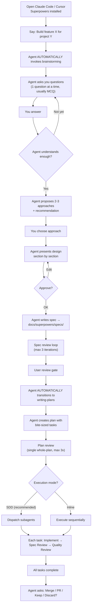

# Superpowers — Playbook v5.0.5

> Practical guide for Superpowers v5.0.5 — installation, usage, troubleshooting.

## Installation & Setup

### Claude Code — Official Marketplace

```bash
# Install from official Claude plugin marketplace
/plugin install superpowers@claude-plugins-official
```

### Claude Code — Community Marketplace

```bash
# Register marketplace
/plugin marketplace add obra/superpowers-marketplace

# Install plugin
/plugin install superpowers@superpowers-marketplace
```

### Cursor (updated v5.0.3)

```text
# In Cursor Agent chat
/add-plugin superpowers
```

> **NOTE:** Cursor uses camelCase hooks format (`hooks-cursor.json`). Platform detection checks `CURSOR_PLUGIN_ROOT` first (Cursor also sets `CLAUDE_PLUGIN_ROOT`).

### Codex

Tell Codex:
```
Fetch and follow instructions from https://raw.githubusercontent.com/obra/superpowers/refs/heads/main/.codex/INSTALL.md
```

### OpenCode (simplified v5.0.4)

Add to `opencode.json`:
```json
{
  "superpowers": "git+https://github.com/obra/superpowers"
}
```

Plugin auto-registers skills — no symlinks or `skills.paths` config needed.

### Gemini CLI (NEW v5.0.1)

Clone repo locally → Gemini CLI auto-detects via `gemini-extension.json`:

```bash
git clone https://github.com/obra/superpowers.git
cd superpowers
# Gemini CLI will load GEMINI.md automatically
```

> **NOTE:** Gemini CLI **does not support subagents**. Skills will auto-fallback to `executing-plans` instead of SDD.

### Verify Installation

After installation, start a new session and try:
- Say: **"help me plan this feature"** → Superpowers auto-triggers brainstorming skill
- Say: **"let's debug this issue"** → Superpowers auto-triggers systematic-debugging skill
- If the agent uses a skill automatically → ✅ installation successful

### Update

```bash
# Claude Code
/plugin update superpowers

# Skills update automatically with the plugin
```

## Day 1 Workflow

### Scenario: You want to build a new feature



### Your Actions on Day 1

| Step | What you do | What the agent does |
|------|-------------|---------------------|
| 1 | Describe feature | Invoke brainstorming |
| 2 | Answer questions | Ask 1 question at a time, MCQ preferred |
| 3 | Choose approach | Propose 2-3 options |
| 4 | Approve design sections | Present section by section |
| 5 | Approve spec (v5.0.1) | Spec review + user review gate |
| 6 | Choose execution mode (v5.0.5) | SDD (recommended) or inline |
| 7 | Say "Go" | Create plan + dispatch subagents |
| 8 | (Wait) | SDD: implement → review → fix per task |
| 9 | Choose Merge/PR/Keep/Discard | Execute choice + cleanup |

**Autonomous run time:** The agent can run **for hours** after you say "Go" without intervention (unless BLOCKED).

## Daily Operations

### When you want to build a new feature

```
"Build [feature description]"
→ Agent auto-triggers: brainstorming → writing-plans → SDD/inline
```

### When you want to fix a bug

```
"Fix [bug description]"
→ Agent auto-triggers: systematic-debugging → 4-phase investigation → TDD fix
```

### When you want to debug a complex issue

```
"Debug: [issue description]"
→ Agent MUST: Root Cause Investigation → Pattern Analysis → Hypothesis → Implementation
→ NO random fixes allowed
```

### When you want to review code

```
"Review the changes I made in [branch/file]"
→ Agent dispatches code-reviewer subagent
```

### When you want to create a custom skill

```
"Help me create a skill for [technique description]"
→ Agent triggers: writing-skills (TDD for documentation)
→ RED: Baseline test → GREEN: Write skill → REFACTOR: Close loopholes
```

### When you want to brainstorm only (no implementation)

```
"Let's brainstorm about [topic]"
→ Agent follows full brainstorming process
→ Ends with spec document, does not auto-transition to implementation
```

## Strategic Configuration

### Instruction Priority

```
User instructions (CLAUDE.md, AGENTS.md) > Superpowers skills > System prompt
```

**Override example:** If `CLAUDE.md` says "don't use TDD" → Superpowers TDD skill is overridden.

### Personal Skills (Shadowing)

Personal skills override superpowers skills with the same name:

```
~/.claude/skills/brainstorming/SKILL.md    ← Agent uses this
plugin/skills/brainstorming/SKILL.md       ← Shadowed
```

Force using the superpowers version:
```
Invoke superpowers:brainstorming   ← Bypasses personal skill
```

### Execution Mode (v5.0.5)

| Mode | When to use | Platform |
|------|-------------|----------|
| **SDD (recommended)** | Full autonomous with review | CC, Codex (subagent support) |
| **Inline** | Manual control, step-by-step | Any platform |
| **Fallback** | Platform doesn't support subagents | Gemini CLI, OpenCode |

### Model Selection for SDD

| Task | Model recommendation | Signal |
|------|---------------------|--------|
| Mechanical implementation | Cheap/Fast | 1-2 files, clear spec |
| Integration tasks | Standard | Multi-file, pattern matching |
| Design/Architecture/Review | Most Capable | Judgment, broad understanding |

### Output Locations

| Content | Default Path | Override |
|---------|-------------|----------|
| Specs | `docs/superpowers/specs/YYYY-MM-DD-<topic>-design.md` | User preference |
| Plans | `docs/superpowers/plans/YYYY-MM-DD-<feature-name>.md` | User preference |
| Personal skills (CC) | `~/.claude/skills/` | — |
| Personal skills (Codex) | `~/.agents/skills/` | — |

## Cheat Sheet

### Skills Reference

| Skill | Triggered when | Iron Law |
|-------|---------------|----------|
| `brainstorming` | Any creative work | NO code before design approved |
| `writing-plans` | Spec/requirements exist for multi-step task | Bite-sized tasks (2-5 min each) |
| `subagent-driven-development` | Plan exists + user chose SDD (v5.0.5) | Fresh subagent per task + two-stage review |
| `executing-plans` | Plan exists + user chose inline / no subagent platform | Execute continuously, stop only on blocker |
| `test-driven-development` | All implementation | NO production code without failing test first |
| `systematic-debugging` | All technical issues | NO fixes without root cause investigation |
| `verification-before-completion` | Before claiming done/fixed/passing | NO claims without fresh verification evidence |
| `using-git-worktrees` | Before starting implementation | Isolated workspace, verify clean baseline |
| `finishing-a-development-branch` | Implementation done, tests pass | Verify tests → Present 4 options → Execute |
| `requesting-code-review` | After each task (SDD) or before merge | Dispatch code-reviewer subagent |
| `receiving-code-review` | Receiving feedback from reviewer | Fix Critical immediately, Important before continuing |
| `dispatching-parallel-agents` | Multiple independent domains | Identify → Create → Dispatch → Integrate |
| `writing-skills` | Creating a new skill | TDD for documentation |
| `using-superpowers` | Every conversation | 1% rule: if a skill COULD apply → MUST invoke |

### TDD Cycle Quick Reference

```
1. RED   — Write failing test (one behavior, clear name)
2. VERIFY RED — Run test, confirm fails correctly (not errors)
3. GREEN — Write MINIMAL code to pass
4. VERIFY GREEN — Run test, confirm ALL pass
5. REFACTOR — Clean up (keep green)
6. REPEAT — Next behavior
```

### SDD Per-Task Flow

```
1. Dispatch implementer subagent (full task text + context only needed — v5.0.2)
2. Handle status: DONE → review | BLOCKED → assess | NEEDS_CONTEXT → provide
3. Dispatch spec reviewer → approved? → yes → next | no → fix → re-review
4. Dispatch quality reviewer → approved? → yes → next task | no → fix → re-review
5. Mark task complete
```

### Review Loop (v5.0.4)

```
1. Reviewer receives COMPLETE document (not chunks)
2. Only flag issues that cause REAL implementation problems
3. Max 3 iterations (was 5)
4. If still unresolved → escalate to human
```

### Finishing Branch Options

| Option | Command | Cleanup worktree? |
|--------|---------|-------------------|
| 1. Merge locally | `git checkout main && git merge <branch>` | ✅ |
| 2. Create PR | `git push -u origin <branch> && gh pr create` | ✅ |
| 3. Keep as-is | (nothing) | ❌ |
| 4. Discard | Type "discard" to confirm | ✅ |

## Troubleshooting

### Installation Issues

| Error | Cause | Fix |
|-------|-------|-----|
| Skills not triggering | Plugin not installed correctly | `/plugin install superpowers` |
| "Legacy skills dir" warning | Old `~/.config/superpowers/skills/` still exists | Delete old dir |
| Codex not loading skills | Not set up correctly | Follow `.codex/INSTALL.md` |
| OpenCode not loading | Not configured correctly | Add 1 line to `opencode.json` (v5.0.4) |
| Cursor hooks error | Platform detection wrong | Use hooks-cursor.json (v5.0.3) |
| Gemini CLI not recognized | Extension not detected | Check `gemini-extension.json` at root |

### Runtime Issues

| Error | Cause | Fix |
|-------|-------|-----|
| Agent doesn't brainstorm and codes directly | Skill not triggered | Say explicitly: "Let's brainstorm first" or check install |
| Agent skips TDD | CLAUDE.md override | Check if CLAUDE.md has "don't use TDD" |
| Subagent BLOCKED continuously | Task too complex | Break task into smaller pieces, upgrade model |
| Review loop runs forever | Reviewer/implementer conflict | Max 3 iterations → escalate (v5.0.4) |
| Spec review skipped | Checklist/flowchart missing step | Fixed v5.0.1 |
| Context re-inject on resume | SessionStart fires on resume | Fixed v5.0.3: no longer fires on `--resume` |

### Brainstorm Server Issues

| Error | Cause | Fix |
|-------|-------|-----|
| Server won't start (Node 22+) | ESM module conflict | server.js → server.cjs (v5.0.5) |
| Server auto-stops after 60s (Windows) | PID namespace invisible | PID monitoring skipped on Windows (v5.0.5) |
| stop-server.sh won't kill process | Process survives SIGTERM | SIGTERM + 2s wait + SIGKILL fallback (v5.0.5) |
| Server orphaned | No idle timeout | 30min idle auto-exit (v5.0.2) |
| `npm install` needed | Dependencies vendored | Zero-dep server.cjs — no npm needed (v5.0.2) |

### Cross-Platform Issues

| Error | Platform | Fix |
|-------|----------|-----|
| Hook hangs indefinitely | macOS Bash 5.3+ (Homebrew) | printf replaces heredoc (v5.0.3) |
| "Bad substitution" | Ubuntu/Debian (dash) | `$0` replaces `${BASH_SOURCE[0]:-$0}` (v5.0.3) |
| Script not found | NixOS, FreeBSD | `#!/usr/bin/env bash` shebangs (v5.0.3) |
| Single quotes break hook | Windows cmd + Linux | Escaped double quotes (v5.0.1) |
| Server silent fail | Windows Git Bash | Auto-detect → foreground mode (v5.0.3) |

## Best Practices

### ✅ Gold Rules

1. **Always let the agent brainstorm first** — Even if the project seems "simple". Anti-pattern: "This is too simple to need a design"
2. **No code before tests** — If you've already coded → DELETE. Start over
3. **Verify before claiming** — Run command → Read output → THEN claim
4. **1 question per message** — Don't overwhelm with multiple questions
5. **Strict YAGNI** — Remove unnecessary features from every design
6. **Commit frequently** — Every completed step → commit
7. **Worktree for all implementation** — Don't code on main/master
8. **Trust the process** — Systematic debugging > random fixes
9. **Two-stage review** — Spec compliance FIRST, code quality SECOND
10. **Escalate when stuck** — After 3 review iterations → ask human (v5.0.4)
11. **Approve spec before plan** — User review gate mandatory (v5.0.1)

### ❌ Anti-Patterns

| Anti-Pattern | Why it's wrong | Replace with |
|-------------|----------------|--------------|
| "Too simple to need a design" | Simple projects have most unexamined assumptions | Brief but MUST brainstorm |
| "I'll test after" | Tests after = test what you built, not what's required | RED-GREEN-REFACTOR |
| "Should work now" | "Should" ≠ evidence | Run verification command |
| "Keep as reference" | You'll adapt it = testing after | Delete means delete |
| "Just this once" | Slippery slope | No exceptions |
| "I need more context first" | Skills tell HOW to explore | Check skills BEFORE exploring |
| "This doesn't need a skill" | If skill exists → use it. 1% rule | Invoke skill first |
| Skip spec review, go to quality | Wrong order! | Spec compliance ✅ THEN quality |
| Minor formatting blocks review | Wastes iterations | Only substance issues (v5.0.4) |

## Custom Skills — Creating New Skills

### SKILL.md Template

```markdown
---
name: my-skill-name
description: Use when [specific triggering conditions]
---

# My Skill Name

## Overview
Core principle in 1-2 sentences.

## When to Use
- Symptom A
- Symptom B
- NOT for: [exclusions]

## The Process
[Steps, flowcharts, checklists]

## Red Flags
[Signs to STOP]

## Common Mistakes
[Anti-patterns + fixes]
```

> ⚠️ **IMPORTANT:** **Description Trap:** Skill descriptions must only contain triggering conditions ("Use when..."), NOT summarize the workflow. Claude will follow the description instead of reading the flowchart if the description is too detailed.

### TDD Process for Skills

```
1. RED: Run baseline scenario (agent WITHOUT skill) → document violations
2. GREEN: Write minimal SKILL.md addressing those violations
3. REFACTOR: Find new rationalizations → plug loopholes → re-verify
```

---

## Resources

| Resource | Link |
|---|---|
| **GitHub** | [obra/superpowers](https://github.com/obra/superpowers) |
